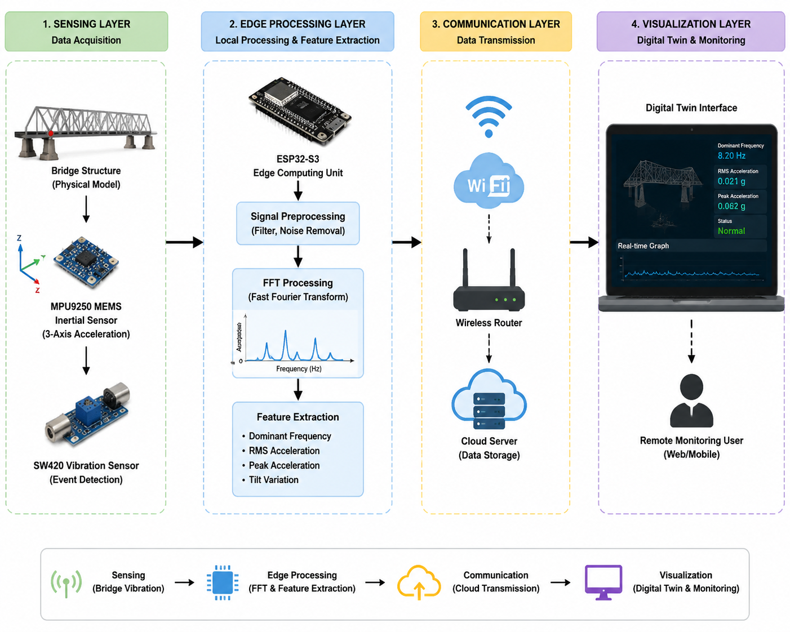
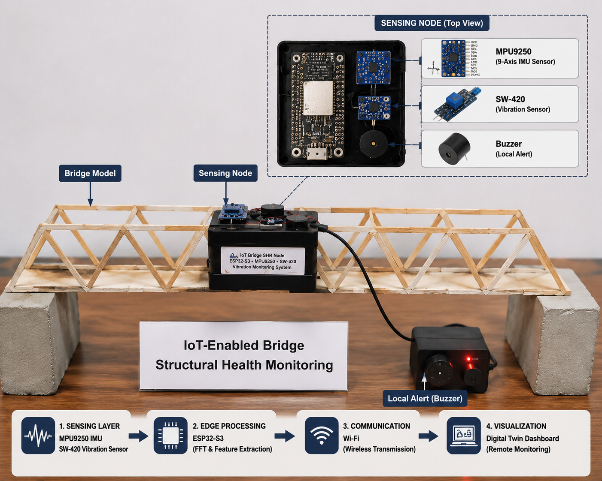
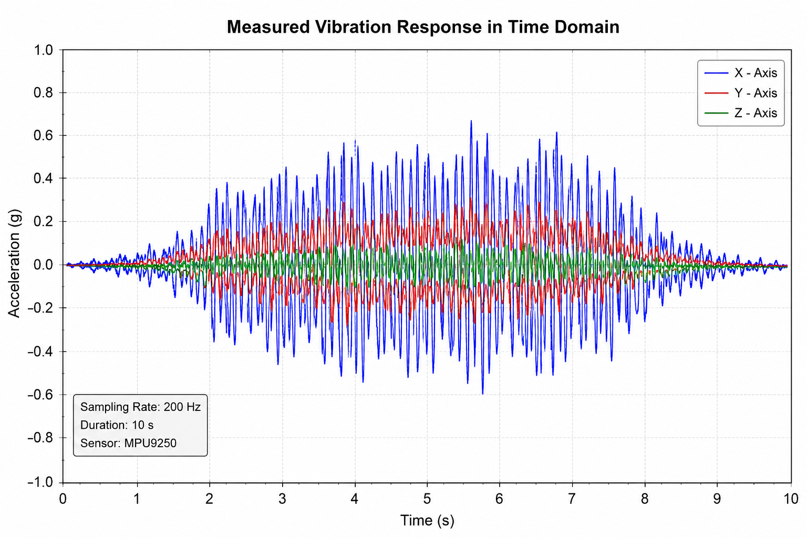
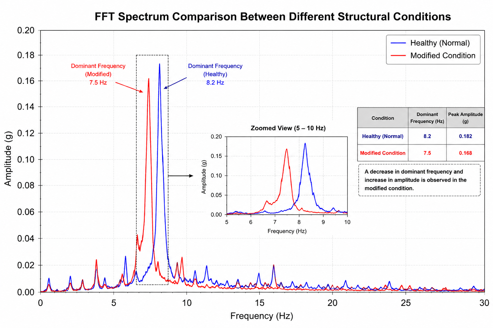
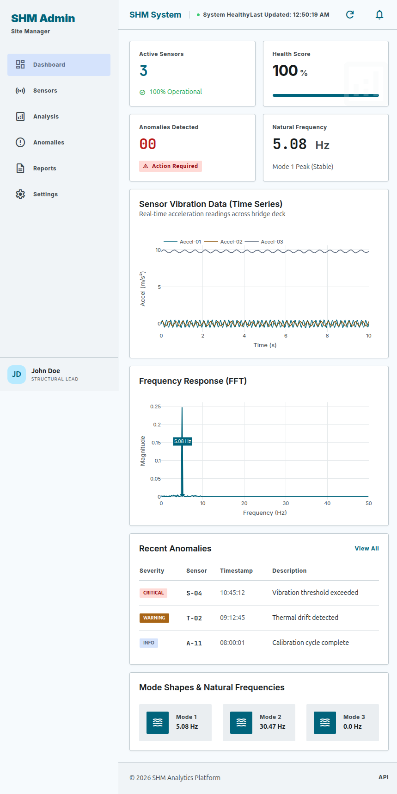
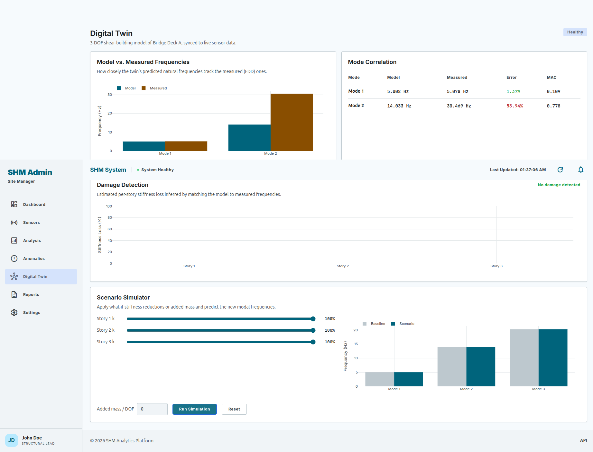

# A Low-Cost IoT-Enabled Bridge Structural Health Monitoring System Using MEMS Vibration Sensing, FFT-Based Analysis, and Digital Twin Visualization

[](https://opensource.org/licenses/MIT)
[](https://www.espressif.com/)
[](https://invensense.tdk.com/)
[](https://github.com/kosme/arduinoFFT)
[](dashboard/)
[](docs/paper/A_Low_Cost_IoT_Enabled_Bridge_Structural_Health_Monitoring_System.pdf)

> **Author**: MD. Rakib Hassan Dipu  
> **Department**: Department of IoT and Robotics Engineering, University of Frontier Technology, Bangladesh  
> **Research Focus**: Cyber-Physical Systems, Structural Health Monitoring (SHM), Edge Computing, Digital Twin  

---

## 📌 Executive Summary & Abstract

Structural Health Monitoring (SHM) of bridge infrastructure is essential for ensuring structural integrity, public safety, and preemptive maintenance. Conventional inspection methodologies are periodic, manual, labor-intensive, and incapable of detecting real-time progressive structural degradation.

This repository hosts the complete open-source implementation of a **Low-Cost IoT-Enabled Bridge Structural Health Monitoring (SHM) Framework**. The system features:
1. **Edge-Level Signal Processing**: High-frequency (200 Hz) vibration data acquisition and onboard 1024-point Fast Fourier Transform (FFT) analysis computed directly on an ESP32-S3 dual-core microcontroller.
2. **Multi-Parameter Damage Assessment**: Real-time extraction of dominant natural frequencies ($f_n$), RMS acceleration energy, peak dynamic responses, and structural tilt orientation.
3. **Synchronized Digital Twin Visualization**: Interactive cyber-physical monitoring dashboard rendering a real-time 2.5D virtual model of the physical bridge, live frequency spectrums, time-domain waveforms, and telemetry via the Web Serial API.

---

## 🚀 Key Highlights & Novelty

- ⚡ **Full On-Chip Edge DSP**: Performs hardware-timed microsecond sampling, Hamming windowing, and 1024-point FFT on-chip, minimizing cloud bandwidth by transmitting only concise extracted feature metrics.
- 💰 **Ultra-Low Cost (<$30 BOM)**: Replaces expensive industrial accelerometer systems with low-power MEMS sensing (MPU9250 9-DOF IMU + SW-420 trigger).
- 🌐 **No-Install Live Digital Twin**: Live web dashboard running in standard browsers with direct USB Web Serial API connectivity and built-in simulation / fault-injection capabilities.
- 🔬 **Laboratory Experimental Validation**: Validated on a scaled truss bridge specimen under healthy and modified stiffness conditions.

---

## 🏗️ System Architecture

The end-to-end framework operates across four interconnected functional layers:

```
+-------------------------------------------------------------------------+
|                          1. SENSING LAYER                               |
|   - MPU9250 (3-Axis Acceleration + 3-Axis Gyro) via I2C Fast-Mode       |
|   - SW-420 Piezoelectric / Spring Shock & Vibration Detector            |
+------------------------------------+------------------------------------+
                                     |
                                     v
+-------------------------------------------------------------------------+
|                      2. EDGE PROCESSING LAYER (ESP32-S3)                |
|   - 200 Hz Hardware-Timed Sampling (5000 µs intervals)                  |
|   - Baseline Calibration & Nominal State Storage                        |
|   - 1024-Point FFT (Hamming Window + Peak Extraction)                   |
|   - RMS Energy, Peak Acceleration, & Tilt (Roll/Pitch) Computation      |
|   - Damage Decision Engine (Frequency Drop >5%, RMS Rise >30%, Tilt >2°)|
+------------------------------------+------------------------------------+
                                     |
                                     v
+-------------------------------------------------------------------------+
|                         3. COMMUNICATION LAYER                          |
|   - USB Serial CDC (115200 Baud) / Web Serial API                       |
|   - Wi-Fi / MQTT JSON Telemetry Stream                                  |
+------------------------------------+------------------------------------+
                                     |
                                     v
+-------------------------------------------------------------------------+
|                     4. DIGITAL TWIN VISUALIZATION LAYER                 |
|   - Synchronized 2.5D Animated Bridge Model (Deflection & Stress)       |
|   - Dynamic FFT Frequency Spectrum (0 - 100 Hz)                         |
|   - Real-Time Time-Domain Waveforms (a_z) & Telemetry Diagnostic Log   |
+-------------------------------------------------------------------------+
```

<p align="center">
  
  <br><em>Figure 1: Architectural overview of the proposed IoT-enabled SHM framework.</em>
</p>

---

## 🔌 Hardware Setup & Circuit Configuration

<p align="center">
  
  <br><em>Figure 2: Physical experimental bridge setup with installed ESP32-S3 sensing node.</em>
</p>

### Wiring Pinout Table

| Sensor / Module | Sensor Pin | ESP32-S3 GPIO | Protocol / Function | Notes |
| :--- | :--- | :--- | :--- | :--- |
| **MPU9250** | `SDA` | **GPIO 41** | I2C Data | 400 kHz Fast-Mode I2C |
| **MPU9250** | `SCL` | **GPIO 42** | I2C Clock | Pull-up enabled |
| **MPU9250** | `VCC` | **3.3V** | Power | Stable 3.3V supply |
| **MPU9250** | `GND` | **GND** | Ground | Common system ground |
| **SW-420** | `DOUT` | **GPIO 47** | Digital Input | Shock / sudden event flag |
| **Buzzer / LED** | `IN / POS` | **GPIO 21** | Digital Output | Local audible/visual warning |

---

## 📐 Mathematical Methodology & Signal Processing

### 1. Vibration Data Acquisition
Acceleration $a_z[n]$ is recorded along the primary vertical dynamic axis at sampling frequency $f_s = 200	ext{ Hz}$ with sampling period:
$$T_s = rac{1}{f_s} = 5000\ \mu	ext{s}$$

### 2. Fast Fourier Transform (FFT) Analysis
To prevent spectral leakage, a 1024-point Hamming window $w[n]$ is applied prior to FFT computation:
$$w[n] = 0.54 - 0.46 \cos\left(rac{2\pi n}{N - 1}
ight), \quad 0 \le n < N$$
$$X[k] = \sum_{n=0}^{N-1} x[n] w[n] e^{-j rac{2\pi}{N} k n}, \quad k = 0, 1, \dots, rac{N}{2}-1$$

The dominant natural frequency $f_{	ext{dom}}$ corresponds to the spectral peak bin $k_{	ext{peak}}$:
$$f_{	ext{dom}} = k_{	ext{peak}} 	imes rac{f_s}{N} = k_{	ext{peak}} 	imes rac{200}{1024}	ext{ Hz}$$

### 3. Statistical Time-Domain Metrics
- **Root Mean Square (RMS) Acceleration**:
  $$	ext{RMS} = \sqrt{rac{1}{N}\sum_{n=0}^{N-1} a_z[n]^2}$$
- **Tilt Orientation (Roll & Pitch)**:
  $$	ext{Roll} = 	ext{atan2}\left(a_y, \sqrt{a_x^2 + a_z^2}
ight) 	imes rac{180}{\pi}$$
  $$	ext{Pitch} = 	ext{atan2}\left(-a_x, \sqrt{a_y^2 + a_z^2}
ight) 	imes rac{180}{\pi}$$

### 4. Structural Damage Decision Criteria
A condition alert is triggered if any of the following boundary limits are exceeded:
- **Frequency Drop**: $\Delta f = rac{f_{	ext{baseline}} - f_{	ext{current}}}{f_{	ext{baseline}}} 	imes 100\% > 5.0\%$
- **Vibration Energy Surge**: $\Delta	ext{RMS} = rac{	ext{RMS}_{	ext{current}} - 	ext{RMS}_{	ext{baseline}}}{	ext{RMS}_{	ext{baseline}}} 	imes 100\% > 30.0\%$
- **Tilt Excursion**: $|	ext{Roll}| > 2.0^\circ \quad \lor \quad |	ext{Pitch}| > 2.0^\circ$

---

## 📊 Experimental Results & Validation

The framework was evaluated on a physical bridge testbed under **Healthy (Baseline)** and **Modified / Damaged** structural states.

### Quantitative Comparison

| Structural State | Dominant Frequency ($f_n$) | Frequency Shift ($\Delta f$) | RMS Acceleration | Condition Assessment |
| :--- | :---: | :---: | :---: | :---: |
| **Healthy State** | **8.20 Hz** | *Baseline (0.0%)* | **0.0210 g** | 🟢 **HEALTHY** |
| **Modified / Damaged** | **7.50 Hz** | **-8.54%** | **0.0380 g (+80.9%)** | 🔴 **POSSIBLE DAMAGE** |

<p align="center">
  
  
  <br><em>Figure 3: Measured dynamic time response (left) and FFT frequency spectra showing dominant frequency downshift under modified condition (right).</em>
</p>

---

## 💻 Digital Twin Visualization Dashboard

The dashboard provides a real-time synchronized virtual twin of the physical bridge, visual alert indicators, and live time/frequency graphs.

<p align="center">
  
  <br><em>Figure 4: Real-time Digital Twin telemetry interface.</em>
</p>

<p align="center">
  
  <br><em>Figure 5: 2.5D virtual bridge model reflecting active sensor nodes and dynamic displacement.</em>
</p>

---

## 📂 Repository Structure

```
.
├── assets/
│   └── images/                     # System diagrams, hardware photos, FFT charts, and screenshots
│       ├── system_architecture.png
│       ├── hardware_setup.png
│       ├── time_signal.png
│       ├── fft_result.png
│       ├── shm_live_dashboard.png
│       ├── shm_twin.png
│       └── dashboard_screenshot.png
├── firmware/
│   ├── Bridge_SHM/
│   │   └── Bridge_SHM.ino          # ESP32-S3 Arduino firmware with 1024-pt FFT & DSP logic
│   └── README.md                   # Firmware flashing and library setup guide
├── dashboard/
│   ├── index.html                  # Interactive HTML5/WebGL Digital Twin Dashboard (Web Serial API)
│   ├── app.py                      # Python Flask/WebSocket telemetry bridge server
│   ├── requirements.txt            # Python dependencies
│   └── README.md                   # Dashboard usage guide
├── docs/
│   ├── paper/
│   │   ├── A_Low_Cost_IoT_Enabled_Bridge_Structural_Health_Monitoring_System.pdf # Main paper
│   │   ├── SHM_Twin.pdf            # Supplementary digital twin documentation
│   │   └── twin.pdf
│   └── references/
│       └── README.md               # Literature survey and comparative study matrix
├── .gitignore                      # Git ignore rules
├── CITATION.cff                    # Citation metadata
├── LICENSE                         # MIT License
└── README.md                       # Main project documentation
```

---

## 🛠️ Quick Start Guide

### 1. Flashing Firmware to ESP32-S3
1. Open [`firmware/Bridge_SHM/Bridge_SHM.ino`](firmware/Bridge_SHM/Bridge_SHM.ino) in Arduino IDE.
2. In **Library Manager**, install:
   - `arduinoFFT` (by Enrique Condes)
   - `MPU9250_asukiaaa` (by Asuki Kono)
3. Select board: **ESP32S3 Dev Module** (Baud: `115200`, USB CDC On Boot: `Enabled`).
4. Connect your ESP32-S3 and click **Upload**.

### 2. Launching the Digital Twin Dashboard

#### Option A: Direct Web Serial in Browser (Zero Installation)
1. Open [`dashboard/index.html`](dashboard/index.html) in Google Chrome or Microsoft Edge.
2. Click **Connect ESP32 (Serial)** and select your ESP32-S3 COM port.
3. Observe real-time synchronized telemetry, bridge deflection, and FFT spectrums!
*(If no hardware is plugged in, click **Simulation** or **Inject Damage** to explore demo mode).*

#### Option B: Running Local Python Server
```bash
cd dashboard
pip install -r requirements.txt
python app.py
```
Navigate to `http://localhost:5000` in your web browser.

---

## 📜 Citation

If you find this project, dataset, or implementation useful in your research, please cite:

```bibtex
@article{dipu2026bridge_shm,
  title={A Low-Cost IoT-Enabled Bridge Structural Health Monitoring System Using MEMS Vibration Sensing, FFT-Based Analysis, and Digital Twin Visualization},
  author={Dipu, MD. Rakib Hassan},
  journal={Department of IoT and Robotics Engineering, University of Frontier Technology},
  year={2026}
}
```

---

## 📄 License

This project is licensed under the **MIT License** - see the [LICENSE](LICENSE) file for details.
